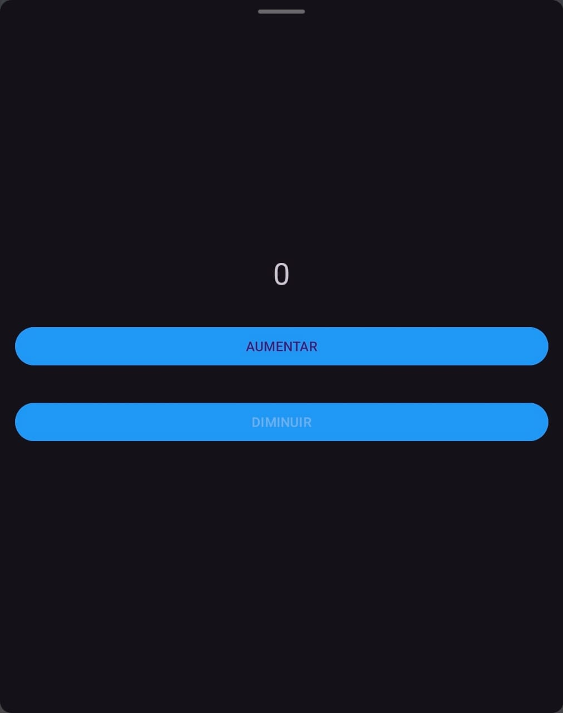

<h1 align="center">Contador</h1>

## Project
This project consists of an Android application that implements a simple counter. The application allows users to increment and decrement a counter through two buttons. It features a clean and intuitive user interface with buttons styled in blue and elements centered vertically on the screen.

## Layout
<div align="center">
  
</div>

## Features
- Increment and decrement buttons to adjust the counter.
- The counter value is displayed in the center of the screen.
- Buttons are styled with a blue background.

User-friendly and responsive design.
## Technologies Used
- **Programming Language:** Java
- **Development Environment:** Android Studio

## Code Author
```kotlin
fun main() {
    println("Code by Gabriela Oliveira!")
}
